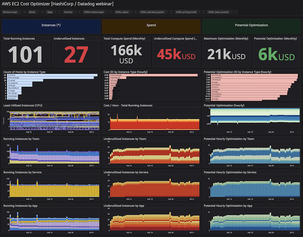

# Minimizing Cloud Waste

> This repository is a collection of Terraform Resources to minimize Cloud Wasste with Datadog.

## Table of Contents

- [Minimizing Cloud Waste](#minimizing-cloud-waste)
  - [Table of Contents](#table-of-contents)
  - [Author Information](#author-information)
  - [License](#license)

## Author Information

This repository is maintained by the contributors listed on [GitHub](https://github.com/ksatirli/minimizing-cloud-waste/graphs/contributors).

## Requirements

* [Terraform](https://www.terraform.io/downloads.html) `1.0.8` or newer
* [Terraform Cloud](https://app.terraform.io/signup/account) account
* [Datadog](https://app.datadoghq.com/signup) account
* [AWS](https://portal.aws.amazon.com/billing/signup) account

## Usage

* Clone this repository and initialise the Terraform provider(s) using `terraform init`.
* Duplicate `terraform.tfvars.sample` to `terraform.tfvars` and fill in your Datadog [API key](https://app.datadoghq.com/account/settings#api) and [application key](https://app.datadoghq.com/access/application-keys).
* Run `terraform plan` to preview the included Dashboard Resource.

If the output of `terraform plan` looks satisfactory, deploy the Dashboard using `terraform apply`.

This repository contains [Terraform Outputs](https://www.terraform.io/docs/language/values/outputs.html) that will include a direct link to the newly created dashboard:

## License

Licensed under the Apache License, Version 2.0 (the "License").

You may obtain a copy of the License at [apache.org/licenses/LICENSE-2.0](http://www.apache.org/licenses/LICENSE-2.0).

Unless required by applicable law or agreed to in writing, software distributed under the License is distributed on an _"AS IS"_ basis, without WARRANTIES or conditions of any kind, either express or implied.

See the License for the specific language governing permissions and limitations under the License.
